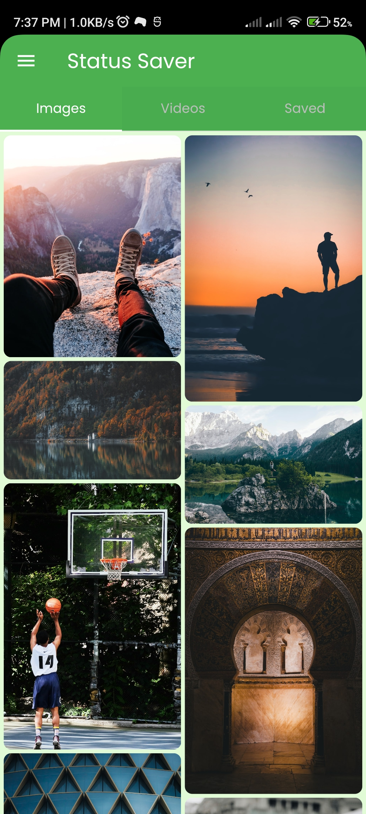
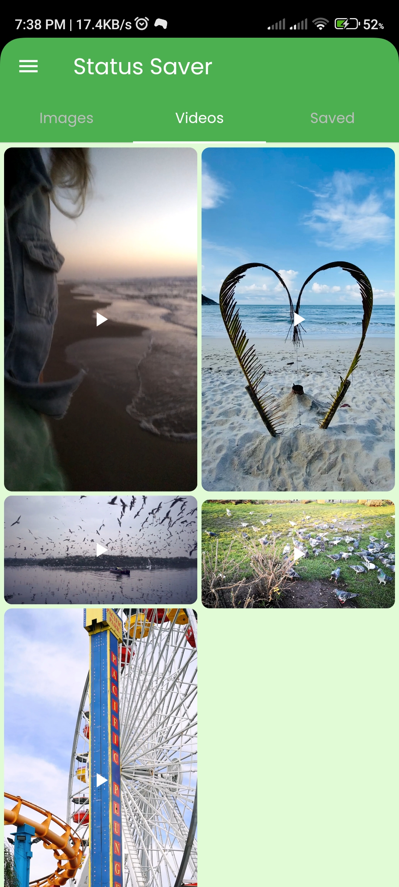
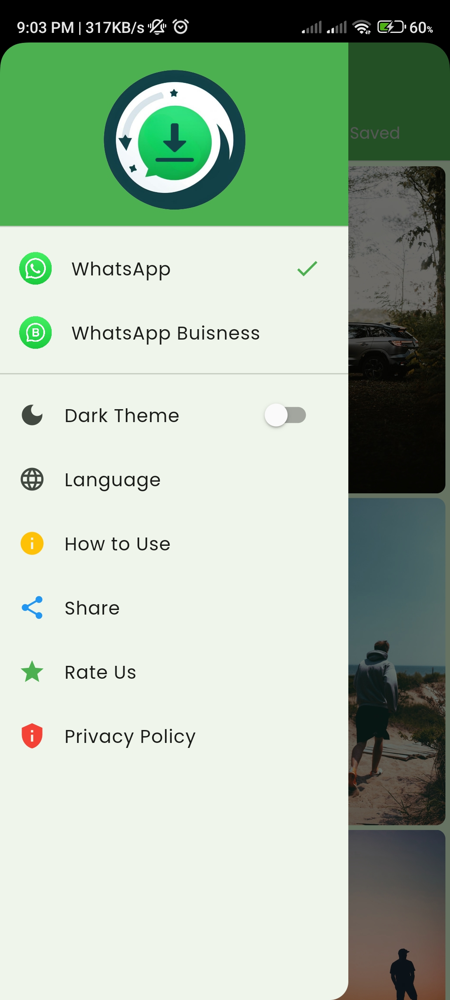
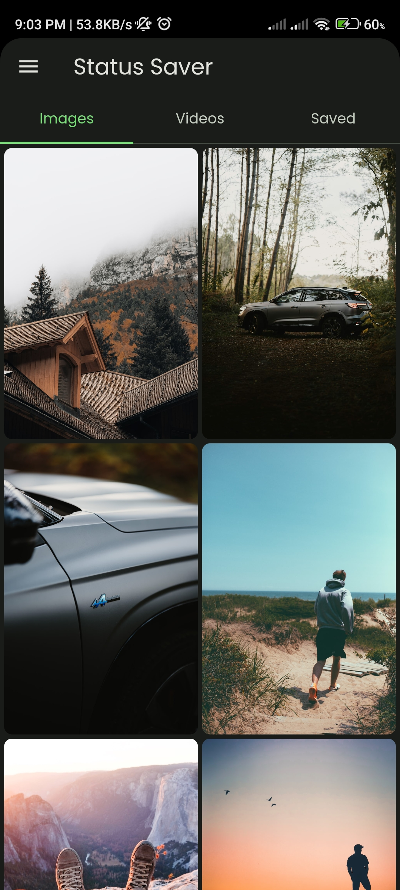
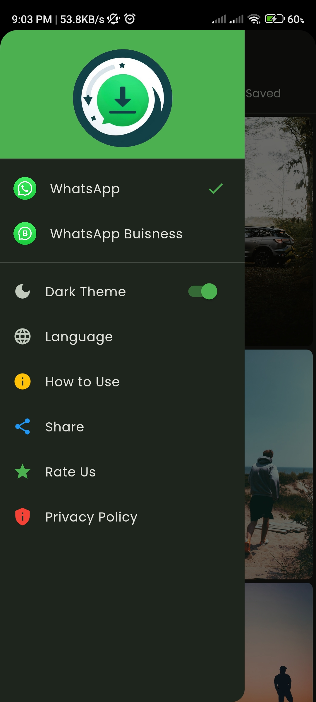

# Whatsapp Status Saver     

A Flutter application designed to save WhatsApp and WhatsApp Business statuses directly to your device's gallery.

## Features

- Personal/Business Whatsapp Statuses
- Light/dark mode toggle
- Localization
- Minimalistic Design
  

## Screenshots

  <table>
    <tr>
      <td style="text-align: center;">
        
      </td>
      <td style="text-align: center;">
        
      </td>
      <td style="text-align: center;">
        
      </td>
      <td style="text-align: center;">
        
      </td>
      <td style="text-align: center;">
        
      </td>
      <!-- Add more screenshots as needed -->
    </tr>
  </table>

## Roadmap

- Firebase Crashlytics

- Ads Integration

## Note

**Important:** This application requires Android 10 or higher as it needs access to "ManageStorage," which is only available in Android versions greater than 10.

For any inquiries or collaborations, feel free to reach out to me:
- Email: arslanch585@gmail.com
- Email: arslanch585@gmail.com
